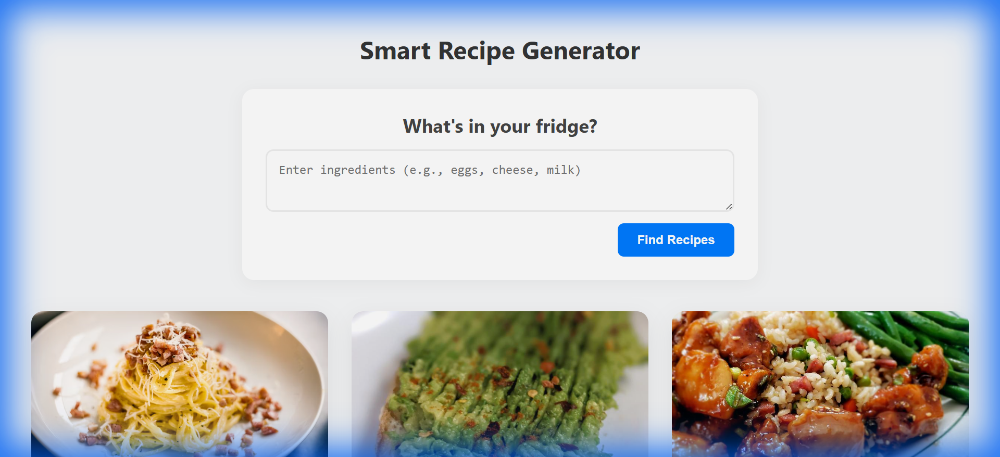
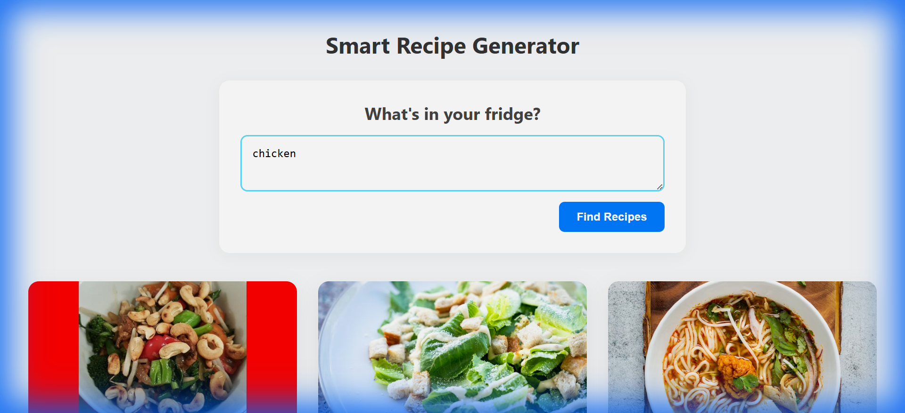
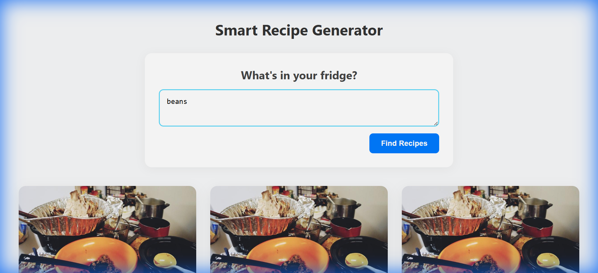

# Smart Recipe Generator

A modern web application that helps you discover recipes based on the ingredients you have. It features a hybrid search system that first checks a local database of curated recipes and falls back to Google's advanced Gemini AI to generate unique recipes when no local matches are found.

## Features

*   **Ingredient-Based Search**:
    The application's search engine is built for speed and reliability, **prioritizing the local database** to instantly retrieve curated recipes that match the user's ingredients. This ensures that common and popular dishes are served immediately without latency. The system only **falls back to the Google Gemini API** when no local matches are found, seamlessly generating unique, custom recipes to ensure the user always finds a solution.
*   **Advanced Filtering & Customization**:
    *   **Filters**: Refine your search by **Difficulty** (Easy, Medium, Hard), **Preparation Time**, and **Dietary Restrictions** (Vegetarian, Vegan, Gluten-Free, Dairy-Free).
    *   **Serving Size**: Adjust the serving size to automatically scale ingredient quantities for your needs.
*   **Interactive User Experience**:
    *   **Rate & Favorite**: Rate recipes (1-5 stars) and save your favorites for quick access.
    *   **Suggestions**: Get personalized recipe recommendations ("You Might Also Like") based on your ratings and favorites.
    *   **Auto-Scroll**: The interface automatically scrolls to results upon searching for a seamless experience.
*   **Responsive Design**: Built with React for a smooth experience on desktop and mobile.
*   **Rich Recipe Details**: Displays ingredients, instructions, nutritional info, difficulty, and preparation time.

## Screenshots

### Home Page
The clean and intuitive interface allows for easy browsing and searching.


### Local Search Results
When you search for common ingredients like "chicken", the app quickly returns verified recipes from its local database.


### AI-Generated Results
Searching for unique combinations or ingredients not in the database (e.g., "beans") triggers the Gemini AI to generate custom recipes just for you.


## Tech Stack

*   **Frontend**: React.js, CSS
*   **Backend**: Node.js, Express.js
*   **AI Integration**: Google Gemini API (`@google/generative-ai`)
*   **Database**: MongoDB (with local fallback to in-memory data)

## Setup Instructions

### Prerequisites
*   Node.js installed on your machine.
*   A Google Gemini API Key.

### Installation

1.  **Clone the repository** (if applicable) or navigate to the project folder.

2.  **Install Server Dependencies**:
    ```bash
    cd server
    npm install
    ```

3.  **Install Client Dependencies**:
    ```bash
    cd ../client
    npm install
    ```

4.  **Configure Environment Variables**:
    *   Create a `.env` file in the `server` directory.
    *   Add your Gemini API Key:
        ```env
        GEMINI_API_KEY=your_api_key_here
        MONGO_URI=your_mongodb_uri (optional, defaults to local/memory)
        PORT=5000
        ```

### Running the Application

1.  **Start the Server**:
    ```bash
    cd server
    npm start
    ```
    The server will run on `http://localhost:5000`.

2.  **Start the Client**:
    ```bash
    cd client
    npm start
    ```
    The client will open in your browser at `http://localhost:3000`.

## Troubleshooting

*   **500 Internal Server Error**: Ensure your `GEMINI_API_KEY` is valid and set in `server/.env`.
*   **Gemini Model Errors**: This project uses `gemini-2.0-flash`. If you encounter model not found errors, check your region availability or update the model name in `server/routes/recipes.js`.
